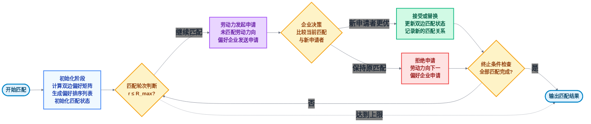
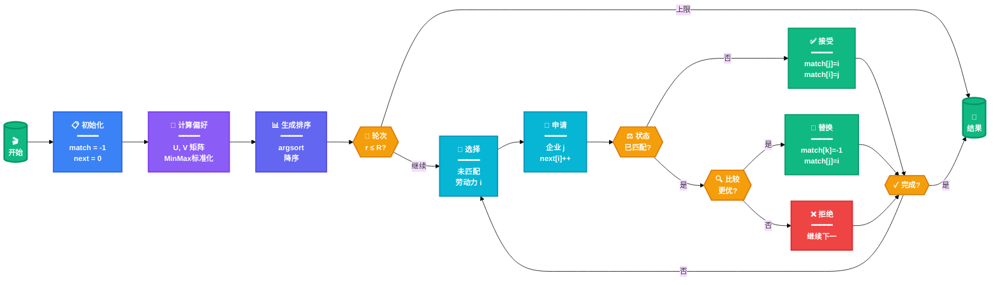
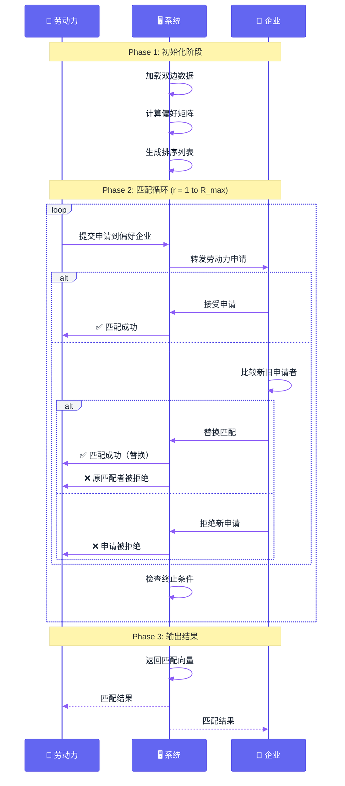
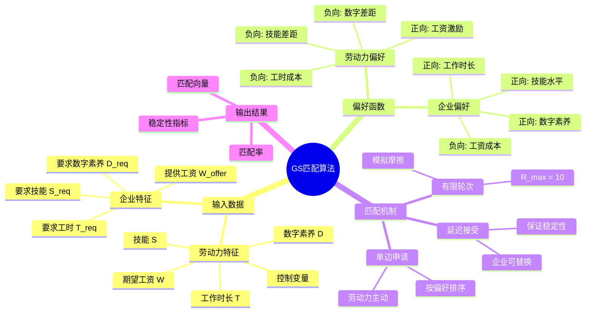

# Gale-Shapley 稳定匹配算法

> **灵活就业市场双边匹配机制**  
> 基于有限轮次的Gale-Shapley算法，模拟市场搜索摩擦

---

## 📊 核心流程图（紧凑双排版）



---

## 🎨 详细算法流程图（横向学术版）



---

## 📐 算法时序图



---

## 🎯 核心概念图



---

## 📊 关键参数说明

### 偏好函数数学表达

**劳动力效用函数**:
$$
U_i^j = \gamma_0 - \gamma_1 \cdot \tilde{T}_{req}^j - \gamma_2 \cdot \max(0, \tilde{S}_{req}^j - \tilde{S}_i) - \gamma_3 \cdot \max(0, \tilde{D}_{req}^j - \tilde{D}_i) + \gamma_4 \cdot \tilde{W}_{offer}^j
$$

**企业效用函数**:
$$
V_i^j = \beta_0 + \beta_1 \cdot \tilde{T}_i + \beta_2 \cdot \tilde{S}_i + \beta_3 \cdot \tilde{D}_i + \beta_4 \cdot \tilde{W}_i
$$

*注: $\tilde{X}$ 表示经过MinMax标准化后的变量*

---

## ⚙️ 算法特性

| 特性 | 说明 | 影响 |
|------|------|------|
| **双边异质性** | 劳动力和企业在多维度上存在差异 | 增加匹配复杂度 |
| **偏好非对称** | 双方偏好函数形式不同 | 体现市场真实性 |
| **有限轮次** | R_max = 10，模拟搜索成本 | 产生市场摩擦 |
| **稳定性** | 无阻塞对（blocking pair） | 保证匹配质量 |
| **计算效率** | Numba JIT加速 | O(R×N×M) |

---

## 💻 实现细节

### 时间复杂度
- **预处理**: O(N×M) - 计算偏好矩阵
- **排序**: O(N×M×log(M)) - 生成排序
- **匹配循环**: O(R_max × N × M) - 迭代匹配
- **总体**: O(R_max × N × M)

### 空间复杂度
- **偏好矩阵**: O(N×M)
- **匹配向量**: O(N + M)
- **总体**: O(N×M)

### 优化技术
- ✅ Numba JIT编译核心循环
- ✅ MinMax标准化保证数值稳定
- ✅ 向量化操作减少循环
- ✅ 早停机制（全部匹配时提前结束）

---

## 📚 参考文献

1. **Gale, D., & Shapley, L. S.** (1962). College admissions and the stability of marriage. *The American Mathematical Monthly*, 69(1), 9-15.

2. **Roth, A. E., & Sotomayor, M. A. O.** (1992). *Two-sided matching: A study in game-theoretic modeling and analysis*. Cambridge University Press.

3. **Abdulkadiroğlu, A., & Sönmez, T.** (2003). School choice: A mechanism design approach. *American Economic Review*, 93(3), 729-747.

---

## 🔧 使用指南

### VSCode预览
1. 安装插件: `Markdown Preview Mermaid Support`
2. 打开此文件
3. 按 `Ctrl+Shift+V` (Win) 或 `Cmd+Shift+V` (Mac)
4. 实时预览所有图表

### 在线编辑
访问 [Mermaid Live Editor](https://mermaid.live/)
- 复制Mermaid代码块
- 在线编辑和预览
- 导出PNG/SVG/PDF

### 导出图片
```bash
# 使用Mermaid CLI
npm install -g @mermaid-js/mermaid-cli

# 导出高清PNG
mmdc -i gs_algorithm_flowchart.md -o flowchart.png -w 2400 -H 1800 -s 2

# 导出矢量SVG
mmdc -i gs_algorithm_flowchart.md -o flowchart.svg
```

---

<div align="center">

**Created with ❤️ for 2025DaChuang Project**

*版本 2.0 | 更新日期: 2025-11-05*

</div>
