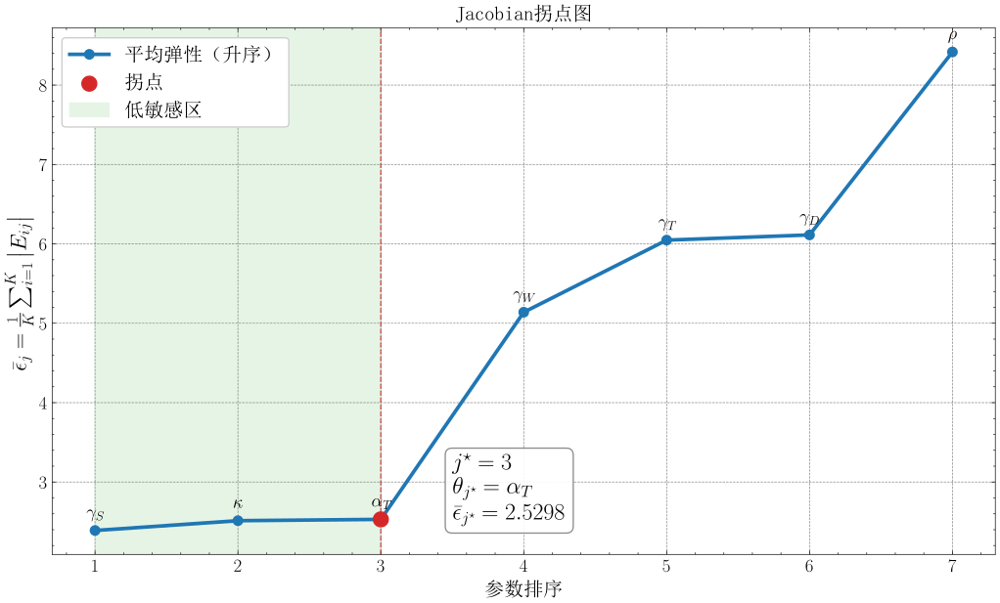

**摘要**

农村女性就业长期受城乡二元结构、家庭照料负担与人力资本不足等多重制约，而现有研究多采用静态实证方法，难以刻画个体异质性决策与宏观市场状态的动态耦合。本文融合主体建模（ABM）与平均场博弈（MFG）理论，构建以异质性主体为核心的离散时间MFG模型，实现微观求职决策与宏观劳动力市场状态的内生互动与动态均衡。在匹配函数构建上，本文基于327份问卷数据，采用Gaussian Copula与Gale-Shapley算法估计具有微观基础的匹配概率函数，并以中国劳动力动态调查数据为目标通过模拟矩估计校准模型参数。研究发现，数字素养对匹配概率的边际效应约为传统工作技能的3倍，凸显数字能力已成为农村女性跨越就业门槛的关键人力资本。政策模拟表明，数字培训、职业技能提升与就业信息优化的组合干预显著优于单一政策。本文为农村女性就业动态分析提供了融合ABM与MFG的微观-宏观耦合方法论框架，也为精准就业政策设计提供了量化模拟工具。

**关键词**：农村女性就业；主体建模；平均场博弈；搜寻匹配理论；政策模拟

---

# 1 引言

全面推进乡村振兴，关键在于盘活农村人力资源。作为劳动力市场重要主体，农村女性就业状况直接影响劳动力资源配置效率。国家统计局《2025年农民工监测调查报告》显示，全国农民工总量超3亿，本地农民工中女性占比达44.5%，但这一群体长期深陷结构性就业困境：受城乡二元结构与传统"男主外、女主内"分工体系制约，农村女性就业以农业为主、非农就业发展缓慢，且多集中于低技能、低报酬的非正式领域(刘越、姚顺波, 2016)；老人赡养、子女抚育的刚性照料负担催生大量"返乡妈妈"群体，其转向"家门口就业"却面临岗位供给不足、匹配度低的现实难题(熊瑞祥、李辉文, 2017)；叠加性别与户籍双重歧视(章莉、李实, 2014)、人力资本储备不足(吴愈晓, 2012)、数字素养偏低形成的数字鸿沟(范明欣等, 2024)，农村女性非农就业比例与工资收入显著偏低(CGSS, 2021)。

搜寻匹配理论为理解劳动力市场摩擦提供了经典框架(Diamond, 1982)，但其宏观视角难以刻画微观异质性决策。基于主体建模(ABM)虽能复现市场典型化事实(Tesfatsion, 2002)，却缺乏对个体决策与宏观状态耦合的严谨刻画。平均场博弈(MFG)理论(Lasry & Lions, 2007) 为处理大量主体互动提供了数学框架，但针对农村女性的动态模拟研究近乎空白。现有文献多采用静态回归分析(刘越、姚顺波, 2016)，缺乏微观与宏观相耦合的系统性研究。

本文致力于回答三个核心问题：第一，农村女性如何动态调整求职努力？第二，个体决策与宏观市场如何相互作用形成均衡？第三，何种政策组合能有效改善农村女性就业状况？本文贡献有三：第一，将MFG框架引入农村女性就业研究，实现微观决策与宏观动态的内生耦合。第二，基于327份问卷数据，采用Gaussian Copula与Gale-Shapley算法构建具有微观基础的匹配概率函数。第三，通过模拟矩匹配校准模型，系统评估多种政策效果，为精准施策提供量化依据。

以下为论文结构安排：第二部分介绍数据来源与变量设定；第三部分构建理论模型；第四部分说明参数校准方法与结果；第五部分分析基准均衡特征；第六部分开展政策模拟；第七部分进行稳健性检验；第八部分提出结论与政策建议。

# 2 数据来源与变量设定

## 2.1 变量选取

本研究通过线上语音通话的方式详细访谈了多名农村女性，以深入了解农村女性的就业现状，获取影响其就业的主要因素。

**表1 个例访谈记录**

根据访谈结果，我们发现，阻碍农村女性就业的主要因素有性别、户籍、家庭责任、工作技能与数字素养。此外，年龄、孩子数量、学历等也是她们担心的问题。考虑到部分因素（如年龄、学历等）虽然影响农村女性的就业，但由于短期内相对固定、政策可干预空间有限，本研究重点关注可通过政策手段加以改善的要素，综合选取了**工作时间、工作待遇、工作能力与数字素养**四个要素，作为问卷设计的主要方面。

## 2.2 问卷设计

本研究使用腾讯问卷平台进行预问卷的发放与回收，选取年龄为18-55岁、常住地为农村/乡镇、无工作的女性作为目标样本群体。问卷构建了在农村女性就业中，**工作时间、（期望）工作待遇、工作能力与数字素养**四个要素的评价体系。

**表2 农村女性就业要素评价体系**

其中，**工作时间**部分选取期望周工作时间指标。**工作待遇**部分参考梁海艳(2019)的研究，在月薪的基础上加入社会保障与劳动合同两个指标，以衡量劳动者"体面工作"情况；**工作能力**部分参考O\*NET网站衡量工作能力的量表，选取阅读、写作等8个与农村女性就业最为相关的指标构建评价体系；**数字素养**部分参考王杰等(2022)的研究，以在网上学习、娱乐等的频率进行衡量。

## 2.3 数据收集与描述性统计

本研究总计收集327份问卷，其中有效问卷300份，有效回答率为91.7%。

**表 3** 连续型变量描述性统计

**表 4** 类别型变量描述性统计

结果表明，样本大多为中年女性，平均育有1-2个孩子，每日家务劳动时间约7小时；接近八成受访者希望工作，尤其是全职与线下工作；平均期望月收入为4521元，期望每周工作41.97小时；平均学历水平相当于高中至大专水平，超过九成有工作经历，平均累计工作年限为8年；平均工作能力评分25.02分、平均数字素养评分8.62分，均接近量表满分值的一半，说明自设计量表能够有效度量受访者的工作能力与数字素养。

**图1** 连续型变量Pearson相关系数热力图

从图1中可以看出，期望工时与期望收入呈中度正相关（0.55），反映出劳动供给意愿与薪酬预期的一致性；学历与工作能力、数字素养评分均呈中度正相关（0.52, 0.54），表明受教育水平对人力资本积累具有正向促进作用。此外，年龄与学历呈较强负相关（−0.75），受此影响，年龄与工作能力（−0.51）、数字素养（−0.49）亦呈中度负相关。

# 3 理论模型

本节构建一个离散时间平均场博弈（Mean-Field Game, MFG）模型，刻画农村女性就业市场中个体求职决策与宏观市场状态的动态交互。MFG理论（Lasry & Lions, 2007）适用于分析大量异质性个体在共享宏观环境下的最优决策及其集体效应。借鉴搜寻匹配理论（Diamond, 1982; Mortensen & Pissarides, 1994），本文将个体求职努力及其对自身状态的动态影响纳入模型，与宏观市场状态的内生演化形成闭环。模型由贝尔曼方程与柯尔莫哥洛夫前向方程（KFE）耦合构成，求解目标为平均场均衡（MFE）。

## 3.1 模型设定

考虑离散时间 $t\  \in \text{\{}0,1,2,\ldots,T\text{\}}$ 的经济体，其中包含连续的异质性农村女性劳动力。每个个体 $i$ 在时刻 $t$ 的可变状态由四维向量刻画：

$$\begin{array}{r}
x_{it} = \left( T_{it},\, S_{it},\, D_{it},\, W_{it} \right) \in \mathbb{R}^{\mathbb{4}}\#(1)
\end{array}$$

其中，$T$ 为劳动供给时间（小时/周），$S$ 为工作能力得分（由问卷中 8 项能力指标加总得到，分值越高表示工作能力越强），$D$ 为数字素养得分（由数字使用频率条目加总得到，分值越高表示数字参与程度越高），$W$ 为期望工资（元/月）。此外，个体具有不随决策变化的固定特征 $\sigma_{i}$（年龄、教育、子女数等）。模型采用的劳动力联合分布拟合摘要与固定特征统计见表5。

**表5  状态变量与固定特征描述性统计**

| **变量** | **均值** | **标准差** | **最小值** | **最大值** |
| --- | --- | --- | --- | --- |
| ***状态变量*** $\mathbf{x}_{\mathbf{i,t}}\mathbf{=}\left( \mathbf{T,S,D,W} \right)^{\mathbf{\top}}$ |  |  |  |  |
| $T$（周工时，小时/周） | 42.26 | 10.36 | 15.00 | 70.00 |
| $S$（工作能力得分） | 24.12 | 8.94 | 2.00 | 44.00 |
| $D$（数字素养得分） | 9.79 | 3.69 | 1.00 | 20.00 |
| $W$（期望月收入，元/月） | 4,559.85 | 1,366.65 | 1,400.00 | 8,000.00 |
| ***固定特征*** $\mathbf{\sigma}_{\mathbf{i}}$***（不随决策变化）*** |  |  |  |  |
| 年龄（岁） | 36.98 | 6.07 | 25 | 50 |
| 子女数量（个） | 1.57 | 0.77 | 0 | 3 |
| 学历（0---6级） | 3.53 | 0.98 | 0 | 6 |

数据来源：状态变量由数值模拟程序的劳动力分布拟合摘要给出（N = 264），固定特征来自问卷调查样本（N = 300）。

个体在任意时刻处于失业（U）或就业（E）状态。失业者选择努力水平 $a_{i,t} \in \lbrack 0,1\rbrack$ 作为核心决策变量，通过式（2）---（5）改善自身状态向量，进而间接提升求职成功概率；就业者被假设不主动施加努力，其状态向量在就业期间保持不变。宏观市场供需状况由市场紧张度 $\theta_{t} = V\text{/}U_{t}$ 刻画，其中 $V$ 为外生岗位空缺数，$U_{t}$ 为内生失业人数（Shimer, 2005）。

个体通过调整努力水平内生地改变自身状态。本文设计如下更新机制：

$$\begin{array}{r}
T_{i,t + 1} = T_{it} + \gamma_{T}a_{it} \cdot \left( T^{\max} - T_{it} \right)\#(2)
\end{array}$$

$$\begin{array}{r}
W_{i,t + 1} = \max\text{\{}W^{\min},\, W_{it} - \gamma_{W}a_{it}\text{\}}\#(3)
\end{array}$$

$$\begin{array}{r}
S_{i,t + 1} = S_{it} + \gamma_{S}a_{it}\left( 1 - S_{it} \right)\#(4)
\end{array}$$

$$\begin{array}{r}
D_{i,t + 1} = D_{it} + \gamma_{D}a_{it}\left( 1 - D_{it} \right)\#(5)
\end{array}$$

公式（2）至（5）阐明了个体如何内生地调整自身状态。其中，$T$ 受 $T^{\max}$ 的物理上限约束，$W$ 的下限为 $W^{\min}$，而技能 $S$ 与数字素养 $D$ 的积累则符合边际收益递减规律（Becker, 1964）。参数 $\gamma$ 表示状态更新的努力敏感度，其校准过程详见第 4 节。

失业者每期以匹配概率 $\lambda\left( x_{it},\sigma_{i},\theta_{t} \right)$ 进入就业状态，就业者每期以离职概率 $\mu\left( x_{it},\sigma_{i} \right)$ 回到失业状态。匹配概率函数的微观基础将在第3.2节构建，离职率函数的具体形式将在第3.4节给出。

模型每期的决策与状态转移时序如图 2 所示。

**图 2  模型每期时序示意图**

<!-- [请在此处插入模型每期时序图（drawio导出）] -->

## 3.2 匹配函数的微观基础

传统搜寻匹配文献通常在宏观层面直接假设匹配函数的参数形式，如 Cobb-Douglas 型（Petrongolo & Pissarides, 2001）。这一做法虽然简便，但存在两方面局限：其一，宏观匹配函数无法反映个体异质性对匹配结果的差异化影响；其二，函数参数缺乏微观行为基础，难以识别具体特征变量的边际效应。为克服上述局限，本文采用 以ABM模拟为基础、辅以Logistic回归的两阶段方法，从微观匹配过程出发构建匹配概率函数 $\lambda\left( x_{it},\sigma_{i},a_{it},\theta_{t} \right)$，使其系数具有可解释的经济含义。

匹配模拟的前提是构建劳动力与企业两侧的人口分布。劳动力侧的分布基于问卷调查数据构建：对连续变量（工作时长 $T$、期望工资 $W$）采用核密度估计（KDE）拟合边际分布，对有界变量（技能水平 $S$、数字素养 $D$）采用经验分布，再利用 Gaussian Copula 方法（Nelsen, 2006）将四维边际分布联结为联合分布 $F_{L}$。 企业侧岗位特征 $f_{j}$（岗位工资、技能要求、数字化程度、工时要求）采用四维正态分布建模，参数依据 CLDS 目标矩及企业分布的描述性统计特征进行锚定。

在两侧分布构建完成后，进行虚拟劳动力市场匹配模拟。给定市场紧张度 $\theta$，从劳动力分布 $F_{L}$ 中抽取 $N$ 个失业者个体，从企业分布中生成$\theta N$个岗位空缺，实施 Gale-Shapley 双边稳定匹配算法（Gale & Shapley, 1962），具体流程见算法1。每批次匹配1,000个劳动力个体，进行多批次模拟后共获得约100,000条匹配数据，生成每个求职者 $i$ 的匹配标签 $y_{i} \in \text{\{}0,1\text{\}}$（1为匹配成功，0为未匹配）。

**算法1：Gale-Shapley 双边稳定匹配算法**

**输入**：$N$ 个求职者（状态向量 $x_{it} = \left( T_{it},S_{it},D_{it},W_{it} \right)$，固定特征 $\sigma_{i}$）； $\theta N$个岗位空缺（岗位特征 $f_{j} = \left( w_{j}^{f},s_{j}^{f},d_{j}^{f},t_{j}^{f} \right)^{\top}$）

**输出**：稳定匹配结果 $\text{\{}(i,j)\text{\}}$ 及每位求职者的匹配标签 $y_{i} \in \text{\{}0,1\text{\}}$

1. **初始化**：所有求职者标记为未匹配；所有岗位标记为空缺

2. **构建求职者偏好**：对每位求职者 $i$，计算其与所有岗位 $j$ 的适配度评分  
   $Q_{ij} = - \lambda_{w}\left| W_{i} - w_{j}^{f} \right| - \lambda_{s}\max\left( s_{j}^{f} - S_{i},0 \right) - \lambda_{d}\max\left( d_{j}^{f} - D_{i},0 \right)$  
   依 $Q_{ij}$ 降序排列，得偏好列表 $\mathcal{P}_{\mathcal{i}}$

3. **构建岗位偏好**：对每个岗位 $j$，计算综合能力指标  
   $C_{i} = \mu_{s}S_{i} + \mu_{d}D_{i} + \mu_{t}T_{i}$  
   依 $C_{i}$ 降序排列，得偏好列表 $\mathcal{R}_{\mathcal{j}}$

4. **repeat**（迭代匹配，求职者主动提议）

5. 每位未匹配求职者向 $\mathcal{P}_{\mathcal{i}}$ 中排名最前的未申请岗位提出申请

6. 每个岗位 $j$ 暂留能力最强的候选者，拒绝其余申请者

7. 被拒绝的求职者将该岗位从 $\mathcal{P}_{\mathcal{i}}$ 中移除

8. **until** 不存在阻塞对或所有求职者的 $\mathcal{P}_{\mathcal{i}}$ 已耗尽

9. 输出稳定匹配对集合；令 $y_{i} = 1$ 若求职者 $i$ 被匹配，否则 $y_{i} = 0$

基于上述模拟数据，以匹配标签 $y_{i}$ 为因变量，以个体特征为自变量，建立 Logistic 回归模型：

$$\begin{array}{r}
\lambda\left( x_{it},\sigma_{i},\theta_{t} \right) = \frac{1}{1 + \exp\left( - \left( \beta_{0} + \beta^{\top}H_{i} \right) \right)}\#(6)
\end{array}$$

其中特征向量 $H_{i}$ 定义为：

$$\begin{array}{r}
H_{i} = \left( T_{it},\, S_{it},\, D_{it},\, W_{it},\,\,\theta_{t},\,\xi_{i}^{\ }\left( age_{i},edu_{i},children_{i} \right) \right)\#(7)
\end{array}$$

$\beta_{0}$ 为截距项，$\beta$ 为特征系数向量，均通过最大似然法估计。式（7）中 $H_{i}$ 同时纳入状态变量、市场紧张度与个体特征，因此匹配概率函数具有清晰的微观解释。基于ABM模拟数据的Logistic回归结果如表6所示。

**表6  匹配概率函数Logistic回归结果**

| **变量** | **系数** | **标准误** | **p 值** | **95% CI** |
| --- | --- | --- | --- | --- |
| 截距项 | −5.735\*\*\* | (0.070) | 0.000 | \[−5.873, −5.597\] |
| 工作时长 (T) | 0.129\*\*\* | (0.001) | 0.000 | \[0.127, 0.131\] |
| 技能水平 (S) | 0.040\*\*\* | (0.001) | 0.000 | \[0.038, 0.041\] |
| 数字素养 (D) | 0.128\*\*\* | (0.002) | 0.000 | \[0.125, 0.132\] |
| 期望工资 (W) | −0.0006\*\*\* | (0.000) | 0.000 | \[−0.001, −0.001\] |
| $\xi$ (age, edu, children) | −0.162\*\* | (0.053) | 0.002 | \[−0.266, −0.058\] |
| $\theta$（市场紧张度） | 0.812\*\*\* | (0.043) | 0.000 | \[0.728, 0.897\] |

注：\*\*\* $p < 0.01$，\*\* $p < 0.05$，\* $p < 0.1$；括号内为标准误。

回归结果显示，$T$、$S$、$D$ 均显著正向影响匹配概率，其中数字素养（$D$）系数 0.128 约为传统技能（$S$）系数 0.040 的3倍，凸显数字能力对农村女性就业的重要性。期望工资（$W$）系数显著为负，与保留工资理论（Mortensen, 1986）一致。控制变量 $\xi$ 系数 −0.162 在5%水平显著，反映年龄、教育和子女数对匹配的结构性制约。市场紧张度 $\theta$ 系数 0.812 高度显著，正向影响匹配概率，与搜寻匹配理论的预测一致。

## 3.3 个体最优决策：贝尔曼方程

设贴现因子为 $\rho \in (0,1)$，反映个体对未来收益的耐心程度。在MFG框架下，每个失业个体将宏观市场状态视为外生给定，并在此环境下选择最优努力水平以最大化跨期期望效用。

处于失业状态的个体值函数 $V_{t}^{U}\left( x,\sigma_{i} \right)$ 满足如下贝尔曼方程：

$$\begin{array}{r}
V_{t}^{U} = \max_{a_{t} \in \lbrack 0,1\rbrack}\left\{ b(x) - \kappa a_{t}^{2} + \rho\left\lbrack \lambda( \cdot )V_{t + 1}^{E}\left( x' \right) + \left( 1 - \lambda( \cdot ) \right)V_{t + 1}^{U}\left( x' \right) \right\rbrack \right\}\#(8)
\end{array}$$

式（8）中各项的经济含义如下。$b(x)$ 为失业状态下的即时收益，包括失业保险金、家庭非劳动收入及闲暇的效用价值。$\kappa a_{t}^{2}$ 为求职努力的成本函数，参数 $\kappa > \ 0$ 控制努力成本的整体水平。$\lambda( \cdot ) = \lambda\left( x_{t},\sigma_{i},\theta_{t} \right)$ 为第3.2节估计的匹配概率函数，$x'$ 为按式（2）---（5）在最优努力 $a_{t}$ 下更新后的下期状态。

处于就业状态的个体值函数为：

$$\begin{array}{r}
V_{t}^{E} = \omega\left( x,\sigma_{i} \right) + \rho\left\lbrack \left( 1 - \mu( \cdot ) \right)V_{t + 1}^{E} + \mu( \cdot )V_{t + 1}^{U} \right\rbrack\#(9)
\end{array}$$

其中 $\omega\left( x,\sigma_{i} \right)$ 为就业工资收入，取决于个体的技能水平、数字素养等状态特征及固定特征；$\mu( \cdot ) = \mu\left( x,\sigma_{i} \right)$ 为外生离职率，其具体函数形式将在第3.4节给出。

## 3.4 群体演化：KFE 方程

第3.3节描述了单个个体的最优决策，本节转向群体层面，刻画失业和就业人口密度在状态空间上的动态演化。在离散时间框架下，人口密度的演化由 Kolmogorov 前向方程（KFE）描述。

在给出KFE之前，首先定义离职率的具体函数形式。本文将外生离职率设定为 Logistic 函数：

$$\begin{array}{r}
\mu\left( x_{it},\sigma_{i} \right) = \frac{1}{1 + \exp\left( - \eta^{\top}Z_{i} \right)}\#(10)
\end{array}$$

其中 $Z_{i}$ 包含个体状态向量与固定特征中影响离职概率的相关变量，$\eta$ 为参数向量。截距项 $\eta_{0}$ 通过配置文件中的离职率目标进行锚定；数值模拟采用的目标宏观离职率为 $\overline{\mu_{\text{target}}}=0.0028$，与 CLDS 2016-2018 追踪样本折算得到的月度离职率口径保持一致。

记时刻 $t$ 状态为 $x$ 的失业人口密度为 $f_{t}^{U}(x)$，就业人口密度为 $f_{t}^{E}(x)$。给定个体最优策略 $a^{*}(x,\sigma)$，失业人口密度的演化方程为：

$$\begin{array}{r}
f_{t + 1}^{U}\left( x' \right) = \sum_{x:g\left( x,a^{*} \right) = x'}^{}\left\lbrack \left( 1 - \lambda( \cdot ) \right)f_{t}^{U}(x) + \mu( \cdot )f_{t}^{E}(x) \right\rbrack\#\left. （11 \right.）
\end{array}$$

就业人口密度的演化方程为：

$$\begin{array}{r}
f_{t + 1}^{E}(x) = \lambda( \cdot )f_{t}^{U}(x) + \left( 1 - \mu( \cdot ) \right)f_{t}^{E}(x)\#(12)
\end{array}$$

式（11）表明：下期处于状态 $x'$ 的失业人口来自两部分------当期未匹配成功且状态更新后到达 $x'$ 的失业者，以及当期离职的就业者。式（12）表示下期就业人口来自新匹配成功的失业者与未离职的存量就业者。两式共同刻画了人口密度在状态空间上的流动与重新分配。

群体分布的演化同时内生地决定了宏观市场状态的更新。总失业人数 $U_{t} = \int_{}^{}{f_{t}^{U}(x)}\, dx$，市场紧张度随之更新为 $\theta_{t} = V\text{/}U_{t}$，进而反馈影响个体的匹配概率与最优决策，形成个体行为与群体分布之间的动态耦合。

## 3.5 平均场均衡的定义与求解

 平均场均衡（Mean-Field Equilibrium, MFE）是求解上述两方程的关键：给定宏观人口分布序列，每个个体的贝尔曼方程存在最优解 $a^{*}(x)$；而在该最优解下，KFE方程描述的群体演化恰好重新生成了该宏观分布，个体最优策略与宏观人口分布构成不动点——在策略与分布的交替映射下保持自我一致——即为均衡所在。

本文采用交替迭代法求解MFE，具体流程见算法2。

**算法2：平均场均衡交替迭代求解**

**输入**：初始人口分布 $m^{(0)}$；初始市场紧张度 $\theta^{(0)}$；阻尼因子 $\delta = \ 0.3$； 收敛容差 $\varepsilon_{V},\varepsilon_{a},\varepsilon_{u}$

**输出**：均衡策略函数 $a^{*}(x)$；均衡人口分布 $m^{U*},m^{E*}$；均衡市场紧张度 $\theta^{*}$

1. 令 $k\  \leftarrow 0$

2. **repeat**（外层迭代）

3. *// 步骤1：个体最优*

4. 给定 $m^{(k)}$ 和 $\theta^{(k)}$，采用值迭代法求解贝尔曼方程：

5. 从 $V^{(0)} \equiv 0$ 出发，逐轮更新，直至 $\text{|}V^{(n + 1)} - V^{(n)}\text{|}_{\infty} < \varepsilon_{V}$

6. 提取最优策略 $a^{(k)}(x) = \arg{\max_{a}\text{\{}}\cdots\text{\}}$

7. *// 步骤2：群体演化*

8. 给定 $a^{(k)}$，蒙特卡洛模拟推进KFE方程，得到 $m^{\text{new}}$ 与新失业人数 $U^{\text{new}}$

9. *// 步骤3：阻尼更新*

10. $m^{(k + 1)} \leftarrow (1 - \delta)\, m^{(k)} + \delta\, m^{\text{new}}$

11. $\theta^{(k + 1)} \leftarrow V\text{/}U^{\text{new}}$

12. $k\  \leftarrow k\  + \ 1$

13. **until** 以下三项收敛条件同时满足：  
    $\text{|}V^{(k)} - V^{(k - 1)}\text{|}_{\infty} < \varepsilon_{V}$    (13a)  
    $\text{|}a^{(k)} - a^{(k - 1)}\text{|}_{\infty} < \varepsilon_{a}$    (13b)  
    $\left| u^{(k)} - u^{(k - 1)} \right| < \varepsilon_{u}$    (13c)

14. **return** $a^{*} = a^{(k)}$，$m^{*} = m^{(k)}$，$\theta^{*} = \theta^{(k)}$

# 4 参数校准（1001字）

## 4.1 校准方法

本文采用模拟矩匹配法（Simulated Method of Moments, SMM）估计模型结构参数（McFadden, 1989；Pakes & Pollard, 1989）。SMM估计量定义为：

$$\begin{array}{r}
\widehat{\theta} = \arg{\min_{\theta}\left\lbrack m^{*} - m(\theta) \right\rbrack}'W\left\lbrack m^{*} - m(\theta) \right\rbrack\#\left. （14 \right.）
\end{array}$$

其中 $m^{*}$ 为从调查数据计算的目标矩向量，$m(\theta)$ 为给定参数 $\theta$ 时的模型模拟矩向量，$W$ 为正定权重矩阵。

为消除不同量纲矩之间的比较困难，本文以各矩的自助法（bootstrap）标准误之倒数平方为权重，构造对角权重矩阵 $W = \text{diag}\left( 1\text{/}\widehat{\sigma_{1}^{2}},\ldots,1\text{/}\widehat{\sigma_{k}^{2}} \right)$，使失业率、平均工资等量纲迥异的矩在目标函数中获得与其估计精度相匹配的权重。数值优化采用差分进化算法（Differential Evolution），以应对目标函数因模型非线性而可能出现的多峰问题。

## 4.2 待校准参数与目标矩

模型包含 7 个结构参数（见表 7）。为评估参数的可识别性，本文基于 Jacobian 矩阵计算各参数对 6 个目标矩的数值弹性，并依据 **图 3（Jacobian 拐点图）** 进行分类：处于左侧、弹性显著偏低的参数（$\kappa, \alpha_T, \gamma_S$）参考现有文献设定固定值；处于右侧、与目标矩存在稳定识别关联的参数（$\gamma_W, \gamma_T, \gamma_D, \rho$）被纳入 SMM 联合估计。

**图 3  Jacobian 拐点图**

**表7  待校准结构参数**

| **参数** | **含义** | **取值范围** |
| --- | --- | --- |
| $$\rho$$ | 贴现因子 | \[0.01, 0.99\] |
| $$\kappa$$ | 求职努力成本系数 | \[100, 10000\] |
| $$\alpha_{T}$$ | 工时偏离负效用系数 | \[0.0, 1.0\] |
| $$\gamma_{T}$$ | 工时状态更新速率 | \[0.01, 1.0\] |
| $$\gamma_{S}$$ | 技能更新速率 | \[0.01, 1.0\] |
| $$\gamma_{D}$$ | 数字素养更新速率 | \[0.01, 1.0\] |
| $$\gamma_{W}$$ | 期望工资更新速率 | \[0.01, 1.0\] |

目标矩来源于中国劳动力动态调查（CLDS）2018年数据中农村女性子样本，本文使用 6 个矩进行校准，具体定义如表8所示。

**表8  目标矩体系**

| **矩编号** | **矩名称** | **目标值** | **数据来源** |
| --- | --- | --- | --- |
| M1 | 失业率 | 3.50% | CLDS 2018 调整口径 |
| M2 | 平均月工资 | 3578.3元 | CLDS 2018，在业女性样本 |
| M3 | 对数工资标准差 | 0.649 | CLDS 2018，在业女性样本 |
| M4 | 平均每周工时 | 52.0小时 | CLDS 2018 + CFPS 修正规则 |
| M5 | 工资四分位距比 | 3.00 | CLDS 2018，在业女性样本 |
| M6 | 每周工时标准差 | 16.7小时 | CLDS 2018 + CFPS 修正规则 |

## 4.3 校准结果

表 9 与表 10 分别呈现当前脚本导出的参数快照与矩拟合情况：

**表 9  参数校准结果**

| **参数** | **含义** | **取值** | **赋值方式** |
| --- | --- | --- | --- |
| $$\kappa$$ | 求职努力成本系数 | 1500.000 | external |
| $$\alpha_{T}$$ | 工时偏离负效用系数 | 0.250 | external |
| $$\gamma_{S}$$ | 技能更新速率 | 0.350 | external |
| $$\rho$$ | 贴现因子 | 0.935 | internal |
| $$\gamma_{T}$$ | 工时状态更新速率 | 0.055 | internal |
| $$\gamma_{D}$$ | 数字素养更新速率 | 0.176 | internal |
| $$\gamma_{W}$$ | 期望工资更新速率 | 0.516 | internal |

**表 10  目标矩拟合对比**

| **矩编号** | **矩名称** | **数据值** | **模拟值** | **相对偏差** |
| --- | --- | --- | --- | --- |
| M1 | 失业率 | 3.50% | 4.21% | +20.3% |
| M2 | 平均月工资 | 3578.3元 | 3531元 | −1.3% |
| M3 | 对数工资标准差 | 0.649 | 0.545 | −16.0% |
| M4 | 平均每周工时 | 52.0h | 47.1h | −9.5% |
| M5 | 工资四分位距比 | 3.00 | 1.831 | −39.0% |
| M6 | 每周工时标准差 | 16.7h | 8.19h | −50.9% |

从拟合结果看，模型在平均月工资（偏差−1.3%）和对数工资标准差（偏差−16.0%）两个矩上实现了较好的校准；失业率偏差+20.3%，与目标处于同一量级。工资分位数比（M5）与工时标准差（M6）的结构性偏差较大，反映模型在横截面异质性刻画上仍有提升空间。

# 5 数值模拟结果分析

## 5.1 基准均衡及其主要特征

本节报告数值模拟在 $N=10\,000$ 个体、200 轮迭代设定下所得的终值结果。基准场景最终失业率为 4.21%，就业者平均工资为 3531 元/月，群体均值分别达到 $T=47.07$ 小时/周、$S=40.80$ 分、$D=14.02$ 分。

图 4 主要展示均衡迭代过程中的价值函数、失业率与努力水平变化；图 5 则刻画失业率与人力资本状态的动态演化。模拟结果表明，失业率在前期快速下降后稳定在 4% 左右，人力资本变量 $S$ 与 $D$ 持续上升，说明模型能够内生呈现求职筛选与人力资本累积的双重机制。

**图 4  MFG 均衡收敛指标随迭代轮次的演化**

图 5 显示，在当前参数设定下，失业率终值略高于目标矩中的 3.5%，但仍稳定落在 4% 附近；与此同时，能力得分与数字素养得分从初始样本均值继续向上演化，说明就业过程中的"干中学"效应确实被模型刻画出来了。

**图 5  均衡收敛过程：失业率与技能水平（$S$、$D$）随迭代轮次的演化路径**

## 5.2 异质性视角：就业者与失业者的特征解构

均衡状态下，就业群体与失业群体在多个维度展现出系统性的禀赋差异。表 11 与图 6 详细对比了两类群体的特征分布。

**表 11  均衡状态下就业者与失业者特征对比**

| **维度** | **就业者均值** | **失业者均值** |
| --- | --- | --- |
| 工作时间 $T$（小时/周） | 47.06 | 47.09 |
| 工作能力得分 $S$ | 40.86 | 38.88 |
| 数字素养得分 $D$ | 14.04 | 13.31 |
| 期望工资 $W$（元/月） | 4525 | 3992 |
| 失业价值 $V^{U}$ | 49610 | 44780 |
| 就业价值 $V^{E}$ | 52982 | 47712 |
| 最优努力 $a^{*}$ | 0.000 | 0.012 |

**图 6  均衡状态下就业者与失业者在技能（$S$）、数字素养（$D$）、期望工资（$W$）和价值函数差异（$V^{E} - V^{U}$）上的分布对比**

分析结果显示，就业者在工作能力、数字素养和价值函数上均明显高于失业者，反映出模型内生的人力资本累积与就业回报机制。失业者的期望工资显著偏低，体现了求职努力引导下保留工资的动态下调过程；同时，失业群体的周工时供给意愿略高于就业者，表明其倾向于通过增加可工作时间来对冲匹配劣势。

## 5.3 努力水平的最优决策分析

图 7 展示了均衡状态下最优努力水平 $a^{*}$ 的分布。就业者不再保留主动搜索努力，其努力水平统一记为 0；失业者的最优搜索强度才是真正需要解释的变量。基准场景下，失业者平均最优努力约为 0.007，说明在现有匹配概率和成本参数下，继续大幅提升搜索投入的边际收益已较为有限。与此同时，高能力个体通常以更低的努力即可获得可接受的匹配结果，表现为图中"能力越高、额外搜索越少"的负向关联。

**图 7  均衡状态下综合技能水平 $S$ 与最优努力 $a^{*}$ 的关系**

# 6 政策实验与反事实模拟

## 6.1 政策情境设计

本文针对农村女性就业的主要障碍设计了四类单项干预政策和一类组合政策，统一与基准场景做反事实比较。表 12 列出各场景对应的模型参数变化方式。

**表 12  政策场景设计**

| **场景** | **政策名称** | **模型参数变动** | **对应现实政策** |
| --- | --- | --- | --- |
| A | 数字素养提升 | 初始 $D$ 提升 30%，同时 $\gamma_D$ 提升 30% | 数字基础设施建设与深度培训 |
| B | 职业技能提升 | 初始 $S$ 提升 10% | 职业培训补贴 |
| C | 就业信息优化 | 目标 $\theta$ 提升 30% | 基层就业信息服务站建设 |
| D | 灵活工时 | $\alpha_T$ 降低 30% | 弹性工作制推行 |
| F | 组合政策 | 同时提升 $D$（30%）、$S$（20%）与 $\theta$（30%） | 数字培训 + 职业培训 + 信息平台综合施策 |

## 6.2 宏观效应与政策优先级

表 13 汇总了各政策场景的主要效果，**图 8** 和 **图 9** 分别从失业率和工资福利维度展示了各场景相对于基准的变化幅度。

**表 13  政策模拟效果汇总**

| **政策场景** | **失业率** | $\mathbf{\Delta}$**失业率(%)** | **平均工资变化（元）** | $\Delta V^{U}$ |
| --- | --- | --- | --- | --- |
| 基准场景 | 4.21% | --- | --- | --- |
| A-数字素养提升 | 4.15% | −1.4% | −0.4 | +57 |
| B-职业技能提升 | 3.85% | **−8.6%** | +16.1 | +270 |
| C-就业信息优化 | 3.93% | −6.7% | +10.5 | +185 |
| D-灵活工时 | 4.12% | −2.1% | **+32.6** | **+328** |
| F-组合政策 | **3.64%** | **−13.5%** | +14.7 | +345 |

注：$\Delta$失业率(%) 指相对于基准场景的相对变化率，计算公式为：(场景失业率 - 基准失业率) / 基准失业率。

**图 8  各政策场景均衡失业率相对基准的变化幅度**

**图 9  各政策场景平均工资与失业者价值函数相对基准的变化**

从模拟结果来看，**组合政策 F** 的效果最为显著，失业率相对基准下降了 13.5%，且伴随工资与失业者福利的同步改善。在单项政策中，**职业技能提升（B）** 对失业率的削减力度最大（−8.6%），并伴随显著的工资正向溢价。**就业信息优化（C）** 同样表现出显著的减压作用（−6.7%）。相比之下，**灵活工时（D）** 虽对总体失业率影响较小（−2.1%），但提供了最高的工资增量和福利补偿。**数字素养提升（A）** 的独立影响有限（−1.4%），主要作为辅助手段为人力资本转型提供基础。

图 10 展示了代表性政策场景下失业率的时序演化路径，组合政策 F 与职业技能提升 B 的路径始终低于基准场景，改善贯穿整个动态调整过程。

**图 10  基准场景与代表性政策场景失业率的动态收敛路径对比**

# 7 稳健性检验与数值分析讨论

为检验主要结论的稳健性，本文对贴现因子 $\rho$、努力成本系数 $\kappa$ 和工时偏离负效用系数 $\alpha_{T}$ 三个核心参数进行灵敏度分析。表 14 汇报了主要测试结果。

**表 14  参数灵敏度分析结果**

| **参数** | **扰动** | **均衡失业率** | **失业率变化(%)** | **平均工资变化(%)** |
| --- | --- | --- | --- | --- |
| $$\rho$$ | −20% | 4.10% | −2.6% | +0.96% |
| $$\rho$$ | −10% | 3.86% | −8.3% | +1.16% |
| $$\kappa$$ | −20% | 4.22% | +0.2% | +0.55% |
| $$\kappa$$ | −10% | 3.72% | −11.6% | +0.49% |
| $$\kappa$$ | +10% | 4.34% | +3.1% | +1.88% |
| $$\kappa$$ | +20% | 4.30% | +2.1% | +1.66% |
| $$\alpha_{T}$$ | −20% | 4.76% | +13.1% | +0.66% |
| $$\alpha_{T}$$ | −10% | 4.18% | −0.7% | +0.82% |
| $$\alpha_{T}$$ | +10% | 4.86% | +15.4% | +1.23% |
| $$\alpha_{T}$$ | +20% | 4.42% | +5.0% | +1.18% |

分参数来看，平均工资对参数扰动不具有敏感性。失业率受工时负效用系数 $\alpha_{T}$ 与努力成本系数 $\kappa$ 的影响较为显著，且 $\alpha_{T}$ 的演化呈现出一定的非线性动力学特征。总体而言，模型在参数扰动下保持了稳健的趋势一致性。

# 8 结论与政策建议

## 8.1 主要研究发现

本文构建了一个离散时间平均场博弈（MFG）模型，将农村女性个体求职决策与宏观劳动力市场状态纳入统一的动态均衡框架，并以模拟矩匹配方法（SMM）完成参数校准，系统评估了多类政策干预的效果。研究主要发现如下。

**微观层面**，失业者的最优求职努力水平保持在较低区间（均值约 0.012），这反映出在当前努力成本与匹配效率下，进一步追加搜索投入的边际收益递减。这种“低努力均衡”并非源于主观意愿，而是结构性就业摩擦对搜寻回报压制的结果。

**中观层面**，基于ABM模拟数据估计的Logistic匹配函数揭示，数字素养（$D$）的匹配概率弹性约为传统技能（$S$）的3倍（系数分别为0.128和0.040）。在数字经济持续渗透的背景下，数字能力已成为农村女性跨越就业门槛的关键人力资本维度。与此同时，期望工资与匹配概率显著负相关，印证了保留工资理论的预测：过高的薪酬预期直接压缩了求职者进入就业状态的概率。

**宏观层面**，均衡失业率约为 4.21%，个体决策与宏观市场在多轮迭代后达到动态均衡。就业者在工作能力、数字素养和长期期望效用上均系统性高于失业者，这表明模型捕捉到了人力资本积累与就业回报的内生关联：就业状态带来的“干中学”效应强化了禀赋优势，而长期失业则可能导致个体陷入相对禀赋劣势的恶性循环。

**政策层面**，组合政策 F（数字素养提升 30% + 职业技能提升 20% + 市场紧张度提升 30%）的失业率削减效果（−13.5%）显著优于任何单项政策，反映出多维干预间的协同效应。单项政策中，职业技能提升（B）的降幅最为可观（−8.6%），而灵活工时（D）在改善就业者工资与福利水平方面更具优势。

## 8.2 政策建议

基于上述发现，本文从三个层面提出政策建议。

**个体层面**，低技能群体是最迫切的政策对象。均衡状态下低技能女性的失业率（5.12%）较高技能群体（3.30%）高出近1.8个百分点，而职业技能提升政策正是在低技能群体中产生了更明显的失业率收窄效果。建议将政府主导的职业培训补贴向低教育水平、高照料负担的农村女性群体倾斜，以定向干预缩小技能差距。

**平台层面**，就业信息优化是低成本、高效率的切入口。模拟显示，通过提升市场紧张度 $\theta$ 带动的信息透明化能够使失业率下降 6.7%。建议加强县域就业公共服务平台建设，提高岗位可见度，以降低供需匹配摩擦。

**政府层面**，应推动数字能力与传统劳动技能培训的深度耦合。研究显示，数字素养提升对长期人力资本形成的意义重大。建议将弹性工时制度作为缓解农村女性照料压力、提高劳动参与回报的重要政策工具。

## 8.3 研究局限

本文在以下方面仍有较大改进空间。其一，企业端岗位特征分布主要基于文献假设和调研数据拟合，缺乏覆盖面更广的一手企业调查，可能导致匹配函数的企业偏好结构与真实市场存在偏差。其二，模型将市场紧张度$\theta$设定为外生调控变量，而真实市场中$\theta$由劳动力供求双方共同内生决定，企业端动态决策尚未纳入模型。其三，本文样本以湖南、海南、浙江等地农村女性为主，地域代表性有限，相关结论向全国或跨区域场景的推广需保持审慎。其四，MFG框架在个体同质性假设方面仍有简化之处，个体间社会网络效应和地理聚集效应尚未被显式刻画。

## 8.4 未来研究方向

未来研究可在以下几个方向推进。第一，引入企业端动态决策，实现市场紧张度的完全内生化，构建内生性的双边MFG模型，以更准确地捕捉供需互动对就业均衡的影响。第二，将模型拓展至时间连续框架，借助Black-Scholes型HJB方程和连续KFE，提升对个体动态决策路径的理论刻画精度。第三，在数据层面引入企业端一手调研，以替代当前基于假设的岗位分布，并扩展样本的地域覆盖范围，增强模型的外部有效性。第四，在后续条件具备时，可将模型预测结果与已实施政策的准自然实验数据对接，对模型的政策预测能力进行外部验证，进一步检验本文方法论框架的现实适用性。

---

# 参考文献

## 中文文献

范明欣、张唯实、李春梅，2024：《数字经济、性别角色与农村女性非农就业》，《辽东学院学报（社会科学版）》第26卷第6期，第36—48页。

梁海艳，2019：《中国流动人口就业质量及其影响因素研究——基于2016年全国流动人口动态监测调查数据的分析》，《人口与发展》第25卷第4期，第44—52页。

刘越、姚顺波，2016：《农村已婚女性就业现状及其影响因素》，《西北农林科技大学学报（社会科学版）》第16卷第5期，第129—135页。

王杰、蔡志坚、吉星，2022：《数字素养、农民创业与相对贫困缓解》，《电子政务》第8期，第15—31页。

吴愈晓，2012：《中国城乡居民教育获得的性别差异研究》，《社会》第32卷第4期，第112—137页。

熊瑞祥、李辉文，2017：《儿童照管、公共服务与农村已婚女性非农就业——来自CFPS数据的证据》，《经济学（季刊）》第16卷第1期，第393—414页。

章莉、李实、William Darity、Rhonda Sharpe，2014：《中国劳动力市场上工资收入的户籍歧视》，《管理世界》第11期，第35—46页。

## 英文文献

Becker, G. S., 1964, *Human Capital: A Theoretical and Empirical Analysis, with Special Reference to Education*, New York: Columbia University Press.

Diamond, P. A., 1982, "Aggregate Demand Management in Search Equilibrium", *Journal of Political Economy*, 90(5), 881—894.

Gale, D. and L. S. Shapley, 1962, "College Admissions and the Stability of Marriage", *The American Mathematical Monthly*, 69(1), 9—15.

Lasry, J.-M. and P.-L. Lions, 2007, "Mean Field Games", *Japanese Journal of Mathematics*, 2(1), 229—260.

McFadden, D., 1989, "A Method of Simulated Moments for Estimation of Discrete Response Models without Numerical Integration", *Econometrica*, 57(5), 995—1026.

Mortensen, D. T., 1986, "Job Search and Labor Market Analysis", in O. Ashenfelter and R. Layard (eds.), *Handbook of Labor Economics*, Vol. 2, Amsterdam: North-Holland, 849—919.

Mortensen, D. T. and C. A. Pissarides, 1994, "Job Creation and Job Destruction in the Theory of Unemployment", *The Review of Economic Studies*, 61(3), 397—415.

Nelsen, R. B., 2006, *An Introduction to Copulas* (2nd ed.), New York: Springer.

Pakes, A. and D. Pollard, 1989, "Simulation and the Asymptotics of Optimization Estimators", *Econometrica*, 57(5), 1027—1057.

Petrongolo, B. and C. A. Pissarides, 2001, "Looking into the Black Box: A Survey of the Matching Function", *Journal of Economic Literature*, 39(2), 390—431.

Shimer, R., 2005, "The Cyclical Behavior of Equilibrium Unemployment and Vacancies", *American Economic Review*, 95(1), 25—49.

Tesfatsion, L., 2002, "Agent-Based Computational Economics: Growing Economies from the Bottom Up", *Artificial Life*, 8(1), 55—82.

